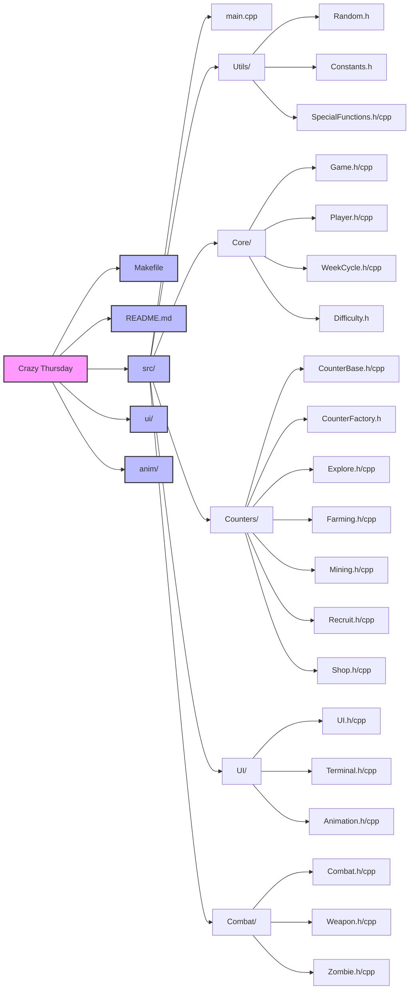

# ENGG1340-COMP2113-GP

## Team members 
[Li Yitong](https://github.com/Lyt060814)&ensp;&ensp;&ensp;&ensp;&ensp;&ensp;&ensp;&ensp;&ensp;(3036289377)

[Qu Sijin](https://github.com/Rosette2048)&ensp;&ensp;&ensp;&ensp;&ensp;&ensp;&ensp;&ensp;&ensp;&ensp;(3036289676)

[Xue Hengtai](https://github.com/R1card0xht)&ensp;&ensp;&ensp;&ensp;&ensp; (3036289391)

[Yu Chuhan](https://github.com/Yu-Chuhan)&ensp;&ensp;&ensp;&ensp;&ensp;&ensp; (3036449006)

[Zhao Dingcheng](https://github.com/sh0redry)&ensp;&ensp;(3036292283)

[Zheng Yilin](https://github.com/Yilinss27)&ensp;&ensp;&ensp;&ensp;&ensp;&ensp;&ensp;(3036289195)
## Quick Start

```bash
make
./bin/game
```

- Press *Enter* to start/continue.
- Press *W/A/S/D*  to move or change the selection in the home or in the fight.
- Press *L* to show the game status and data.
- Press *H* to delete all the change and return to home.
- Tips:
    - DO NOT press *enter* many times, otherwise it may cause unexpected scene skipping.

## Description
 Welcome to this post-apocalyptic world built with C++ code. Here, you'll play as the leader of a shelter in a world ravaged by a zombie outbreak, guiding survivors to gather resources and explore the environment. Your ultimate goal is to strive to survive for until the day rescue arrives!  

The story unfolds in the year 2025 when a zombie outbreak erupts at HKU. You and your group project teammates have built a makeshift shelter. Survive here long enough to await rescue and secure your chance to live through this catastrophe!

The zombies originate from virus-infected classmates who retain peculiar residual memories, manifesting in behavioral patterns like ceasing activity on weekends. Most crucially, Thursdays hold heightened significance for them – a tactical advantage for survivors but also a harbinger of intensified danger!

Within your sanctuary's limited operational capacity, you and fellow survivors must strategically select a single task per day. Will you harvest gold coins from the mine to upgrade your defensive arsenal, or cultivate crops to sustain your population – with surplus yields even enabling recruitment of new survivors? Strategic allocation of labor will determine your survival odds!

Or will you venture into the chaotic wastelands with your companions – where every expedition balances between claiming glory or suffering disgrace? A single decision could mean discovering precious supplies... or returning empty-handed to face starvation's grim specter!

When crimson Thursday dawns – that cursed cycle triggering the horde's primal rage – zombies unleash their frenzied siege, battering against your defenses with unnatural ferocity. This is your trial by fire: deploy strategic mastery to fortify your stronghold, channeling every upgraded turret and stockpiled resource. Hold the line until dawn brings salvation... or die trying!

Our wasteland odyssey blends base-building progression, tactical shooting mechanics, and roguelike randomization – where no two playthroughs unfold identically. While countless survival strategies exist in this dynamic ecosystem, we entrust you to forge your own path to victory through emergent gameplay. The wasteland awaits your legend – survival starts now!

## File Structure



## File Descriptions

### Core Components
- **[Game.cpp/h](src/Core/Game.h)**: Manages the main game loop, state transitions, and overall game flow
- **[Player.cpp/h](src/Core/Player.h)**: Handles player data, survivor management, and resource tracking
- **[WeekCycle.cpp/h](src/Core/WeekCycle.h)**: Controls the game's time system and zombie behavior patterns
- **[Difficulty.h](src/Core/Difficulty.h)**: Defines game difficulty levels and their associated parameters

### Game Mechanics
- **[CounterBase.cpp/h](src/Counters/CounterBase.h)**: Base class for all game counters and activities
- **[CounterFactory.h](src/Counters/CounterFactory.h)**: Implements the factory pattern for creating different types of counters
- **[Explore.cpp/h](src/Counters/Explore.h)**: Manages exploration mechanics and resource discovery
- **[Farming.cpp/h](src/Counters/Farming.h)**: Handles crop growth and food production
- **[Mining.cpp/h](src/Counters/Mining.h)**: Controls resource gathering and mining operations
- **[Recruit.cpp/h](src/Counters/Recruit.h)**: Manages survivor recruitment and population
- **[Shop.cpp/h](src/Counters/Shop.h)**: Handles trading and upgrades

### Combat System
- **[Combat.cpp/h](src/Combat/Combat.h)**: Core combat mechanics and battle resolution
- **[Weapon.cpp/h](src/Combat/Weapon.h)**: Weapon properties and combat calculations
- **[Zombie.cpp/h](src/Combat/Zombie.h)**: Zombie behavior, stats, and special abilities

### User Interface
- **[UI.cpp/h](src/UI/UI.h)**: Main interface system and screen management
- **[Terminal.cpp/h](src/UI/Terminal.h)**: Terminal display and text rendering
- **[Animation.cpp/h](src/UI/Animation.h)**: Game animations and visual effects

### Utilities
- **[Constants.h](src/Utils/Constants.h)**: Game constants and configuration values
- **[Random.h](src/Utils/Random.h)**: Random number generation utilities
- **[SpecialFunctions.cpp/h](src/Utils/SpecialFunctions.h)**: Helper functions used throughout the game
