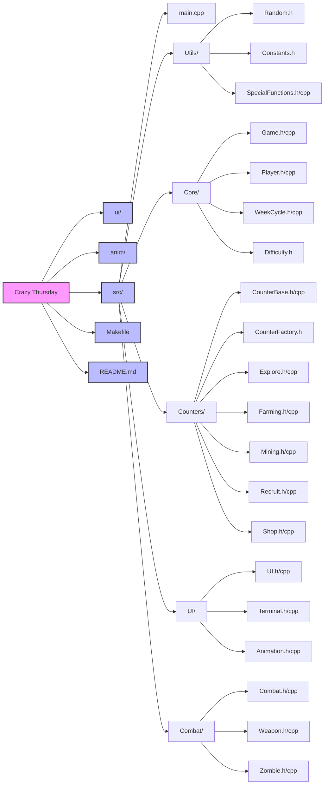
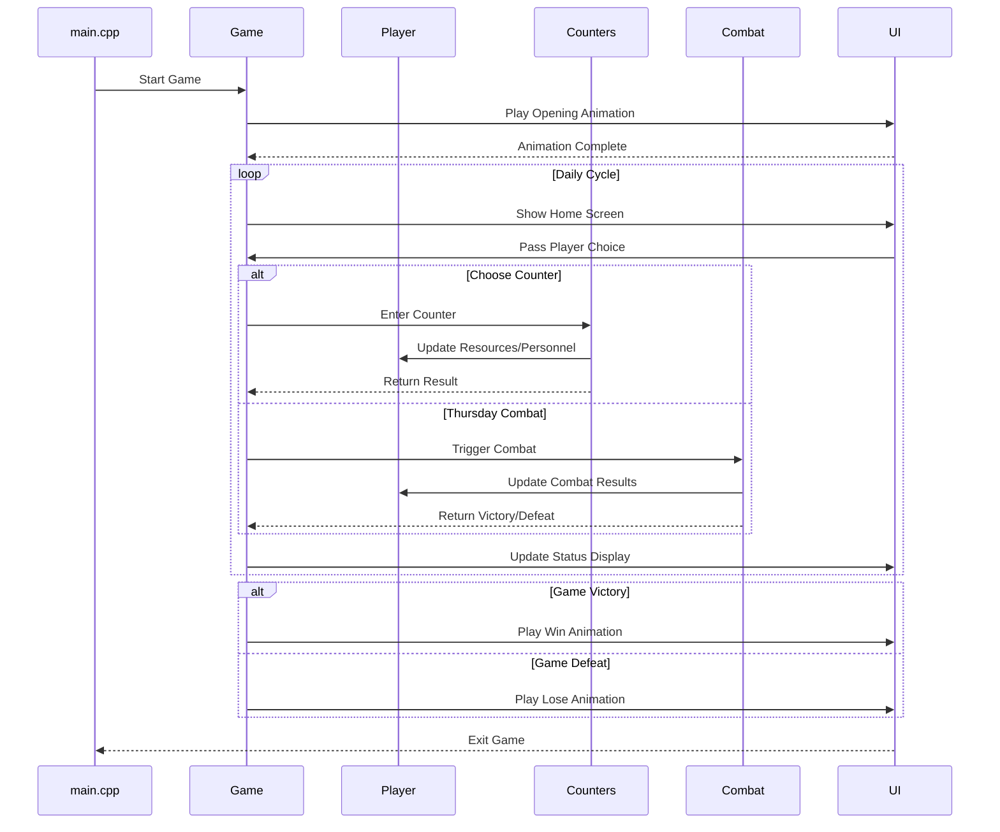

# Team Members

<!-- markdownlint-disable MD033 -->

<table>
    <tbody>
        <tr>
            <th>Name</th>
            <th>UID</th>
            <th>Profile</th>
        </tr>
        <tr>
            <td>Li Yitong</td>
            <td>3036289377</td>
            <td><a href="https://github.com/Lyt060814"></a></td>
        </tr>
        <tr>
            <td>Qu Sijin</td>
            <td>3036289676</td>
            <td><a href="https://github.com/Rosette2048"></a></td>
        </tr>
        <tr>
            <td>Xue Hengtai</td>
            <td>3036289391</td>
            <td><a href="https://github.com/R1card0xht"></a></td>
        </tr>
        <tr>
            <td>Yu Chuhan</td>
            <td>3036449006</td>
            <td><a href="https://github.com/Yu-Chuhan"></a></td>
        </tr>
        <tr>
            <td>Zhao Dingcheng</td>
            <td>3036292283</td>
            <td><a href="https://github.com/sh0redry"></a></td>
        </tr>
        <tr>
            <td>Zheng Yilin</td>
            <td>3036289195</td>
            <td><a href="https://github.com/Yilinss27"></a></td>
        </tr>
    </tbody>
</table>

<!-- markdownlint-enable MD033-->

## Contributions

- [**Li Yitong**](https://github.com/Lyt060814): Lead developer responsible for core game architecture and system design. Implemented [main game classes](src/Core/) and [terminal settings](src/UI/Terminal.h) (Game, Player, Terminal), developed [necessary utilities](src/Utils/), handled code refactoring and optimization, enhanced game documentation, and wrote [README file](README.md).

- [**Qu Sijin**](https://github.com/Rosette2048): Developed animation effect ([Animation class](src/UI/Animation.h)), designed [start/end frames](anim/), implemented [Explore counter class](src/Counters/Explore.h), and contributed to game interface development.

- [**Xue Hengtai**](https://github.com/R1card0xht): Main designer of the whole game. Implemented [three counter classes](src/Counters/) (Farming, Mining, Recruit) and corresponding [user interfaces](ui/), developed [difficulty selection](src/Core/Difficulty.h), optimized difficulty settings, and recorded demo video.

- [**Yu Chuhan**](https://github.com/Yu-Chuhan): Designed [user interfaces](ui/) and implemented it ([UI class](src/UI/UI.h)), developed [Shop counter classes](src/Counters/Shop.h), Drew beautiful logo, handled copy writing and edited demo video.

- [**Zhao Dingcheng**](https://github.com/sh0redry): Implemented [combat system classes](src/Combat/) (Combat, Weapon, Zombie) and improved them with different difficulties, optimized game frame rate and movement logic, designed [start/end animation of combat](anim/), and wrote [README file](README.md).

- [**Zheng Yilin**](https://github.com/Yilinss27): Developed [Weekcycle System](src/Core/WeekCycle.h) and corresponding [user interfaces](ui/Days/), implemented [combat system classes](src/Combat/) (Combat, Weapon, Zombie), tested the game and adjusted the number settings.

> **Note:** Due to some operations like **Merge** and **Bulk Edits to .txt Files**, the GitHub metrics may not reflect our true efforts. Everyone in our team was actively involved in the project and there is no free rider.


# Description

:wave: **Welcome to a post-apocalyptic world built with C++!** You are the leader of a shelter in a world overrun by zombies. Guide your survivors to gather resources, explore the wasteland, and hold out until rescue arrives.  

The year is 2025. A zombie outbreak has erupted at HKU, and you and your teammates have built a makeshift shelter. The infected—former classmates—still retain strange habits, like becoming inactive on weekends. But **Thursdays** are different: zombies grow more aggressive, posing both danger and opportunity.  

Within your sanctuary's limited operational capacity, you and fellow survivors must strategically select a single task per day. Will you harvest gold coins from the mine to upgrade your defensive arsenal, or cultivate crops to sustain your population? Or you may venture into the chaotic wastelands with your companions – where every expedition balances between claiming glory or suffering disgrace. **Strategic allocation of labor will determine your survival odds!**

When **crimson Thursday** dawns – that cursed cycle triggering the horde's primal rage – zombies unleash their frenzied siege, battering against your defenses with unnatural ferocity. This is your trial by fire: deploy strategic mastery to fortify your stronghold, channeling every upgraded turret and stockpiled resource. **Hold the line until dawn brings salvation... or die trying!**

This world blends **base-building, tactical combat, and roguelike randomness**—no two playthroughs are the same. Forge your own path to survival. **The wasteland awaits!**

# How to play
## Quick Demo

## Compilation

Prerequisite:

- This repository.
- A working `g++` compiler that supports `C++17`
- `make`

To compile:

```bash
make
```

To run the game:

```bash
./bin/game
```

Or if you prefer one step:

```bash
make run
```
### Terminal Size

1. **Maximize your terminal window to its fullest extent.**

   On Windows, you can achieve this by pressing the `Alt+Enter` key combination, which will toggle the terminal to fullscreen mode.


2. **Adjust the font size to make the box fit the screen.**
     
    After running the game, you will see a message: `Please adjust your terminal size to make the box fit the screen` shown in a box.
    The box is the user interface of the game, and you should make it almost fill the screen.

## Short Tutorial
### In main menu / home
- Press *Enter* to select/continue/enter the counter.
- Press *W/A/S/D*  to move or change the selection in the home.
- Press *L* to show the game status and data.
- Press *Q* to quit the game.
### In counters
- Press *Enter* to confirm input.
- Press *H* to delete all the change and return to home.
- Press *L* to show the game status and data.
- Press *Q* to quit the game.
- Press *W* to show the weapon information.**(Only available in the shop)**
### In combat
- Press *A/D* to move left/right.
- Press *Z/C* to move faster.
- Press *Space* to shoot.
- Press *P* to pause the fight.
>**Tips:** DO NOT press *Enter* many times, otherwise it may cause unexpected scene skipping.


# Game Implementation
## File Structure


## Source Code Descriptions

### Core Components
- **[Game.cpp/h](src/Core/Game.h)**: Manages the main game loop, state transitions, and overall game flow
- **[Player.cpp/h](src/Core/Player.h)**: Handles player data, survivor management, and resource tracking
- **[WeekCycle.cpp/h](src/Core/WeekCycle.h)**: Controls the game's time system and zombie behavior patterns
- **[Difficulty.h](src/Core/Difficulty.h)**: Defines game difficulty levels and their associated parameters

### Game Mechanics
- **[CounterBase.cpp/h](src/Counters/CounterBase.h)**: Base class for all game counters and activities
- **[CounterFactory.h](src/Counters/CounterFactory.h)**: Implements the factory pattern for creating different types of counters
- **[Explore.cpp/h](src/Counters/Explore.h)**: Manages exploration mechanics and resource discovery
- **[Farming.cpp/h](src/Counters/Farming.h)**: Handles crop growth and food production
- **[Mining.cpp/h](src/Counters/Mining.h)**: Controls resource gathering and mining operations
- **[Recruit.cpp/h](src/Counters/Recruit.h)**: Manages survivor recruitment and population
- **[Shop.cpp/h](src/Counters/Shop.h)**: Handles trading and upgrades

### Combat System
- **[Combat.cpp/h](src/Combat/Combat.h)**: Core combat mechanics and battle resolution
- **[Weapon.cpp/h](src/Combat/Weapon.h)**: Weapon properties and combat calculations
- **[Zombie.cpp/h](src/Combat/Zombie.h)**: Zombie behavior, stats, and special abilities

### User Interface
- **[UI.cpp/h](src/UI/UI.h)**: Main interface system and screen management
- **[Terminal.cpp/h](src/UI/Terminal.h)**: Terminal display and text rendering
- **[Animation.cpp/h](src/UI/Animation.h)**: Game animations and visual effects

### Utilities
- **[Constants.h](src/Utils/Constants.h)**: Game constants and configuration values
- **[Random.h](src/Utils/Random.h)**: Random number generation utilities
- **[SpecialFunctions.cpp/h](src/Utils/SpecialFunctions.h)**: Helper functions used throughout the game

## Data Flow

