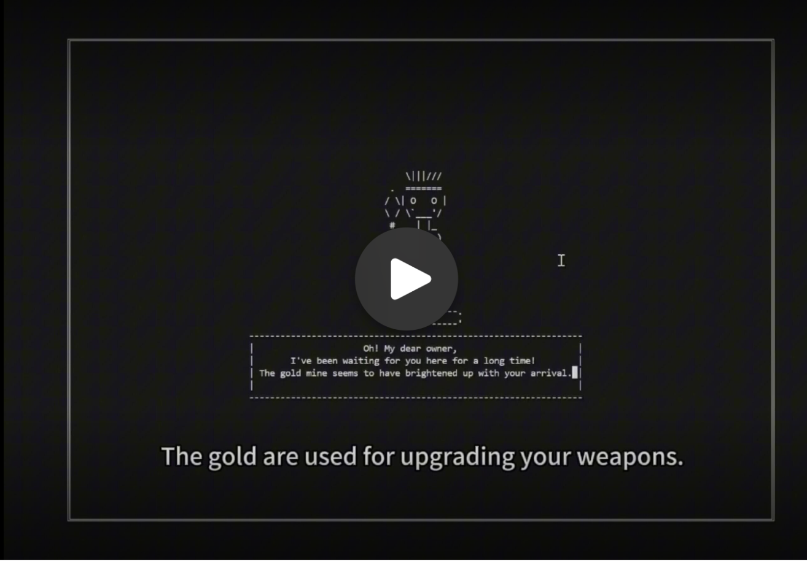
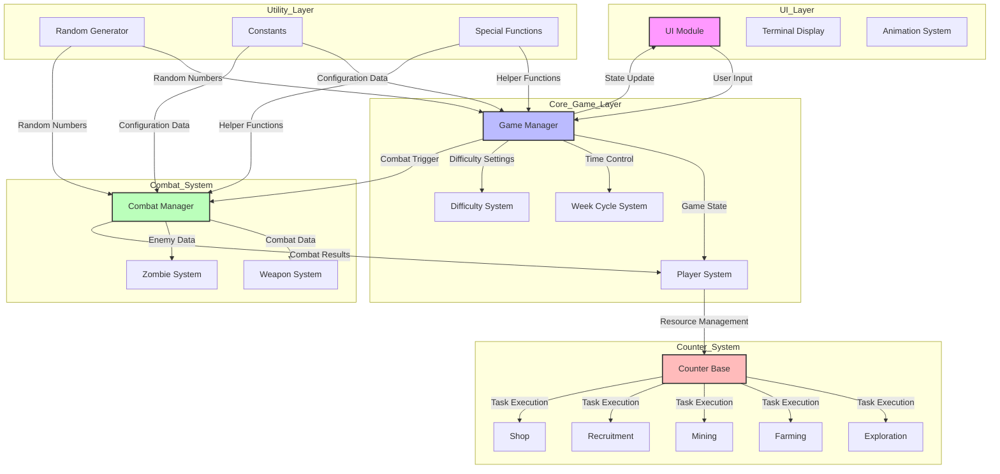
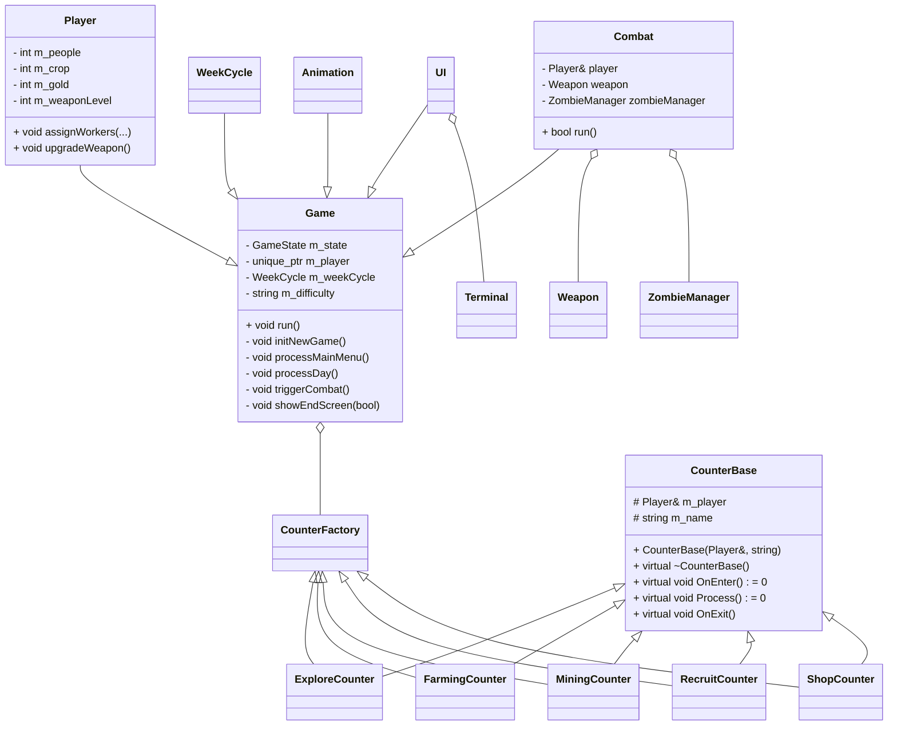
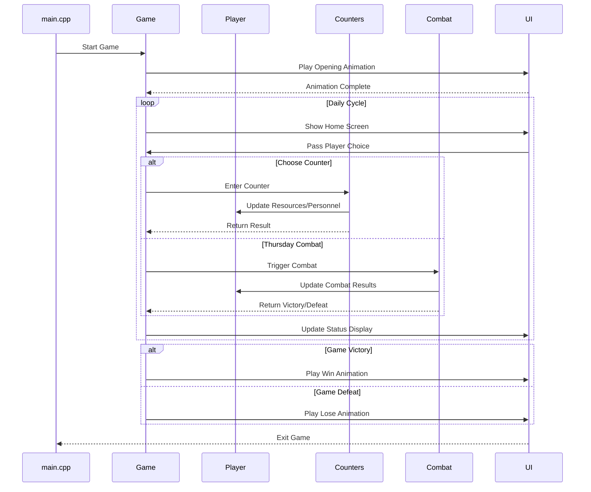

# Menu

- [Menu](#menu)
- [Team Members](#team-members)
  - [Contributions](#contributions)
- [Description](#description)
- [How to play](#how-to-play)
  - [Demo](#demo)
  - [Quick Start](#quick-start)
    - [Terminal Size](#terminal-size)
  - [Short Tutorial](#short-tutorial)
    - [In main menu / home](#in-main-menu--home)
    - [In counters](#in-counters)
    - [In combat](#in-combat)
- [Overview](#overview)
  - [Core Components](#core-components)
    - [Object Model Hierarchy](#object-model-hierarchy)
    - [Game Class](#game-class)
    - [Player Class](#player-class)
    - [Combat Class](#combat-class)
    - [CounterBase and Resource Counters](#counterbase-and-resource-counters)
  - [Data Flow](#data-flow)
  - [File Structure](#file-structure)
- [Code Requirements](#code-requirements)
  - [Generation of Random Game Events](#generation-of-random-game-events)
  - [Data Structures for Storing Data](#data-structures-for-storing-data)
  - [Dynamic Memory Management](#dynamic-memory-management)
  - [File Input/Output](#file-inputoutput)
  - [Program Codes in Multiple Files](#program-codes-in-multiple-files)
  - [Multiple Difficulty Levels](#multiple-difficulty-levels)
  - [Proper Indentation and Naming Styles](#proper-indentation-and-naming-styles)
  - [In-Code Documentation](#in-code-documentation)
- [Non-standard Libraries](#non-standard-libraries)

# Team Members

<!-- markdownlint-disable MD033 -->

<table>
    <tbody>
        <tr>
            <th>Name</th>
            <th>UID</th>
            <th>Profile</th>
        </tr>
        <tr>
            <td>Li Yitong</td>
            <td>3036289377</td>
            <td><a href="https://github.com/Lyt060814"></a></td>
        </tr>
        <tr>
            <td>Qu Sijin</td>
            <td>3036289676</td>
            <td><a href="https://github.com/Rosette2048"></a></td>
        </tr>
        <tr>
            <td>Xue Hengtai</td>
            <td>3036289391</td>
            <td><a href="https://github.com/R1card0xht"></a></td>
        </tr>
        <tr>
            <td>Yu Chuhan</td>
            <td>3036449006</td>
            <td><a href="https://github.com/Yu-Chuhan"></a></td>
        </tr>
        <tr>
            <td>Zhao Dingcheng</td>
            <td>3036292283</td>
            <td><a href="https://github.com/sh0redry"></a></td>
        </tr>
        <tr>
            <td>Zheng Yilin</td>
            <td>3036289195</td>
            <td><a href="https://github.com/Yilinss27"></a></td>
        </tr>
    </tbody>
</table>

<!-- markdownlint-enable MD033-->

## Contributions

- [**Li Yitong**](https://github.com/Lyt060814): Lead developer responsible for core game architecture and system design. Implemented [main game classes](src/Core/) and [terminal settings](src/UI/Terminal.h) (Game, Player, Terminal), developed [necessary utilities](src/Utils/), handled code refactoring and optimization, enhanced game documentation, and wrote [README file](README.md).

- [**Qu Sijin**](https://github.com/Rosette2048): Developed animation effect ([Animation class](src/UI/Animation.h)), designed [start/end frames](anim/), implemented [Explore counter class](src/Counters/Explore.h), and contributed to game interface development.

- [**Xue Hengtai**](https://github.com/R1card0xht): Main designer of the whole game. Implemented [three counter classes](src/Counters/) (Farming, Mining, Recruit) and corresponding [user interfaces](ui/), developed [difficulty selection](src/Core/Difficulty.h), optimized difficulty settings, and recorded demo video.

- [**Yu Chuhan**](https://github.com/Yu-Chuhan): Designed [user interfaces](ui/) and implemented it ([UI class](src/UI/UI.h)), developed [Shop counter classes](src/Counters/Shop.h), Drew beautiful logo, handled copy writing and edited demo video.

- [**Zhao Dingcheng**](https://github.com/sh0redry): Implemented [combat system classes](src/Combat/) (Combat, Weapon, Zombie) and improved them with different difficulties, optimized game frame rate and movement logic, designed [start/end animation of combat](anim/), and wrote [README file](README.md).

- [**Zheng Yilin**](https://github.com/Yilinss27): Developed [Weekcycle System](src/Core/WeekCycle.h) and corresponding [user interfaces](ui/Days/), implemented [combat system classes](src/Combat/) (Combat, Weapon, Zombie), tested the game and adjusted the number settings.

> **Note:** Due to some operations like **Merge** and **Bulk Edits to .txt Files**, the GitHub metrics may not reflect our true efforts. Everyone in our team was actively involved in the project and there is no free rider.


# Description

:wave: **Welcome to a post-apocalyptic world built with C++!** You are the leader of a shelter in a world overrun by zombies. Guide your survivors to gather resources, explore the wasteland, and hold out until rescue arrives.  

:zombie: The year is 2025. A zombie outbreak has erupted at HKU, and you and your teammates have built a makeshift shelter. The infected—former classmates—still retain strange habits, like becoming inactive on weekends. But **Thursdays** are different: zombies grow more aggressive, posing both danger and opportunity.  

:hammer_and_pick: Within your sanctuary's limited operational capacity, you and fellow survivors must strategically select a single task per day. Will you harvest gold coins from the mine to upgrade your defensive arsenal, or cultivate crops to sustain your population? Or you may venture into the chaotic wastelands with your companions – where every expedition balances between claiming glory or suffering disgrace. **Strategic allocation of labor will determine your survival odds!**

:bomb: When **crimson Thursday** dawns – that cursed cycle triggering the horde's primal rage – zombies unleash their frenzied siege, battering against your defenses with unnatural ferocity. This is your trial by fire: deploy strategic mastery to fortify your stronghold, channeling every upgraded turret and stockpiled resource. **Hold the line until dawn brings salvation... or die trying!**

:question: This world blends **base-building, tactical combat, and roguelike randomness**—no two playthroughs are the same. Forge your own path to survival. **The wasteland awaits!**

# How to play
## Demo

[](https://connecthkuhk-my.sharepoint.com/:v:/g/personal/u3628937_connect_hku_hk/EYUCHmNUm1dEgQp9J-2tvTkBLi6YYdC4FUeOmeJlG3Nz8Q)

## Quick Start

Prerequisite:

- Root directory of this repository.
- A working `g++` compiler that supports `C++17`
- `make`

To compile:

```bash
make
```

To run the game:

```bash
./bin/game
```

Or if you prefer one step:

```bash
make run
```

To clean the build files:

```bash
make clean
```
> If you use `CMake`:
> ```bash
> mkdir build && cd build
> cmake ..
> make
> cd ../bin
> ./Crazy_Thursday
> ```

### Terminal Size

1. **Maximize your terminal window to its fullest extent.**

   On Windows, you can achieve this by pressing the `Alt+Enter` key combination, which will toggle the terminal to fullscreen mode.


2. **Adjust the font size to make the box fit the screen.**
     
    After running the game, you will see a message: `Please adjust your terminal size to make the box fit the screen` shown in a box.
    The box is the user interface of the game, and you should make it almost fill the screen.

## Short Tutorial
### In main menu / home
- Press ***Enter*** to select/continue/enter the counter.
- Press ***W/A/S/D***  to move or change the selection in the home.
- Press ***L*** to show the game status and data.
- Press ***Q*** to quit the game.
### In counters
- Press ***Enter*** to confirm input.
- Press ***H*** to delete all the change and return to home.
- Press ***L*** to show the game status and data.
- Press ***Q*** to quit the game.
- Press ***W*** to show the weapon information. **(Only available in the shop)**
### In combat
- Press ***A/D*** to move left/right.
- Press ***Z/C*** to move faster.
- Press ***Space*** to shoot.
- Press ***P*** to pause the fight.
>**Tips:** DO NOT press ***Enter*** many times, otherwise it may cause unexpected scene skipping.


# Overview
The game follows a component-based architecture with a central Game Engine coordinating various subsystems.


## Core Components

### Object Model Hierarchy
The codebase is organized around several core classes, each responsible for a major aspect of the game's logic and flow. The design emphasizes modularity and clear separation of concerns, with `Game` as the central coordinator, and `Player`, `Combat`, and `CounterBase` (and its derivatives) as key subsystems.


---
### Game Class
The `Game` class serves as the **central coordinator** for the entire game. Its main responsibilities include:
- **Managing the main game loop** (`run()`), which drives the progression of days, events, and combat.
- **Maintaining game state** (e.g., current day, difficulty, and references to all major subsystems).
- **Coordinating interactions** between the player, counters (resource systems), and combat.
- **Handling state transitions** (e.g., from main menu to gameplay, or from gameplay to combat).
- **Initializing and cleaning up** game resources.

The `Game` class holds references to:
- A `Player` object (managing resources and upgrades)
- A `WeekCycle` object (tracking the passage of time)
- A `CounterFactory` (for creating and managing resource counters)
- A `Combat` object (for handling zombie sieges)
- UI and Animation subsystems

---

### Player Class
The `Player` class encapsulates all **player-related data and operations**, including:
- **Resource management**: tracks population, food (crop), gold, and weapon level.
- **Worker assignment**: manages how many people are assigned to each resource counter (farming, mining, recruiting, shopping, exploring).
- **Upgrades**: handles weapon upgrades and their costs.
- **Daily consumption**: processes food consumption and population changes.
- **Difficulty**: stores and provides access to the current difficulty setting.

The `Player` class provides methods for:
- Adding/subtracting resources (`addCrop`, `addGold`, `addPeople`)
- Assigning and resetting workers
- Upgrading weapons
- Querying current resource and worker status

---

### Combat Class
The `Combat` class manages the **combat system** during zombie sieges. Its responsibilities include:
- **Player movement and shooting**: processes user input for real-time combat.
- **Zombie management**: spawns and moves zombies, checks for collisions.
- **Weapon usage**: integrates with the player's weapon upgrades.
- **Game state management**: tracks health, time, and win/loss conditions.
- **Pause and resume**: supports pausing the combat sequence.

The `Combat` class interacts closely with the `Player` (for health, weapon, and upgrades) and the `WeekCycle` (for difficulty scaling).

---

### CounterBase and Resource Counters
The `CounterBase` class is an **abstract base class** for all resource management systems (counters), such as farming, mining, recruiting, shopping, and exploring. Its key features:
- **Polymorphic interface**: defines virtual methods (`OnEnter`, `Process`, `OnExit`) for entering, processing, and exiting a counter.
- **Player reference**: each counter operates on the player's resources and assignments.
- **Key callback management**: provides utility functions for handling user input (e.g., returning to home, special actions).
- **Extensibility**: derived classes (e.g., `FarmingCounter`, `MiningCounter`) implement specific resource logic.

The `CounterFactory` is responsible for creating the appropriate counter objects as needed.

## Data Flow
The main game loop follows this sequence:



## File Structure
The codebase is organized into multiple files and directories, each handling specific aspects of the game:

| Directory | File | Description |
|--------|------|-------------|
| **Core/** | [Game.cpp/h](src/Core/Game.h) | Manages the main game loop, state transitions, and overall game flow |
| | [Player.cpp/h](src/Core/Player.h) | Handles player data, survivor management, and resource tracking |
| | [WeekCycle.cpp/h](src/Core/WeekCycle.h) | Controls the game's time system and zombie behavior patterns |
| | [Difficulty.h](src/Core/Difficulty.h) | Defines game difficulty levels and their associated parameters |
| **Counters/** | [CounterBase.cpp/h](src/Counters/CounterBase.h) | Base class for all game counters and activities |
| | [CounterFactory.h](src/Counters/CounterFactory.h) | Implements the factory pattern for creating different types of counters |
| | [Explore.cpp/h](src/Counters/Explore.h) | Manages exploration mechanics and resource discovery |
| | [Farming.cpp/h](src/Counters/Farming.h) | Handles crop growth and food production |
| | [Mining.cpp/h](src/Counters/Mining.h) | Controls resource gathering and mining operations |
| | [Recruit.cpp/h](src/Counters/Recruit.h) | Manages survivor recruitment and population |
| | [Shop.cpp/h](src/Counters/Shop.h) | Handles trading and upgrades |
| **Combat/** | [Combat.cpp/h](src/Combat/Combat.h) | Core combat mechanics and battle resolution |
| | [Weapon.cpp/h](src/Combat/Weapon.h) | Weapon properties and combat calculations |
| | [Zombie.cpp/h](src/Combat/Zombie.h) | Zombie behavior, stats, and special abilities |
| **UI/** | [UI.cpp/h](src/UI/UI.h) | Main interface system and screen management |
| | [Terminal.cpp/h](src/UI/Terminal.h) | Terminal display and text rendering |
| | [Animation.cpp/h](src/UI/Animation.h) | Game animations and visual effects |
| **Utils/** | [Constants.h](src/Utils/Constants.h) | Game constants and configuration values |
| | [Random.h](src/Utils/Random.h) | Random number generation utilities |
| | [SpecialFunctions.cpp/h](src/Utils/SpecialFunctions.h) | Helper functions used throughout the game |

# Code Requirements
## Generation of Random Game Events
- In [`src/Utils/Random.h`](src/Utils/Random.h), a complete random number generation system is implemented, providing multiple random number generation functions:
  - `Range<T>`: Generates random integers within a specified range
  - `RangeReal<T>`: Generates random floating-point numbers within a specified range
  - `Chance`: Makes probability-based random decisions

- In [`src/Counters/Explore.cpp`](src/Counters/Explore.cpp), the random system is used to generate exploration results:
  ```cpp
  if (Random::Chance(lossProbability)) {
      return ExploreResult::PEOPLE_LOST;
  }
  ```

## Data Structures for Storing Data
The code uses several data structures to store game status:

- In [`src/Combat/Zombie.h`](src/Combat/Zombie.h), the `Zombie` struct is used to store game status:
  ```cpp
  struct Zombie {
      int x;          // X coordinate position
      int y;          // Y coordinate position
      int health;     // Current health points
    
      Zombie(int x, int y, int health);
      char getDisplayChar() const;
  };
  ```
- In [`src/UI/Terminal.h`](src/UI/Terminal.h), the `TerminalSize` struct is used to store terminal window dimensions:
    ```cpp
    struct TerminalSize {
        int width;   // Terminal width in characters
        int height;  // Terminal height in characters
    };
    ```

## Dynamic Memory Management
The code uses several STL containers for dynamic memory management:

- Vector in `ZombieManager`:
    ```cpp
    std::vector<Zombie> zombies;   // Collection of active zombies
    ```

- Map in `Player`:
    ```cpp
    /**
     * @brief Weapon upgrade costs for each level
     * Key: Weapon level (1-9)
     * Value: Gold cost for upgrading to next level
     */
    const std::map<int, int> Player::WEAPON_UPGRADE_COST = {
        {1, 30}, {2, 30}, {3, 30}, {4, 40}, {5, 40},
        {6, 40}, {7, 50}, {8, 50}, {9, 50}
    };
    ```

## File Input/Output
The code implements file I/O in several places:

- UI File Reading in [`src/UI/UI.cpp`](src/UI/UI.cpp):
    ```cpp
    std::string UI::LoadUI(const std::string& filename) {
        std::ifstream file(filename);
        if (!file.is_open()) {
            throw std::runtime_error("Failed to open UI file: " + filename);
        }
        std::stringstream buffer;
        buffer << file.rdbuf();
        return buffer.str();
    }
    ```

- Animation File Reading in [`src/UI/Animation.cpp`](src/UI/Animation.cpp):
    ```cpp
    void Animation::PlaySequence(const std::string& dirPath, int frameDelayMs) {
        auto frames = GetSortedFrames(dirPath);
        if (frames.empty()) {
            throw std::runtime_error("No animation frames found in: " + dirPath);
        }

        for (const auto& frameFile : frames) {
            UI::ShowInterface(dirPath + "/" + frameFile);
            std::this_thread::sleep_for(std::chrono::milliseconds(frameDelayMs));
        }
    }
    ```

## Program Codes in Multiple Files
- Code is organized in multiple directories:
  - [`src/Core/`](src/Core/): Core game logic
  - [`src/Combat/`](src/Combat/): Combat system
  - [`src/UI/`](src/UI/): User interface
  - [`src/Counters/`](src/Counters/): Game counters
  - [`src/Utils/`](src/Utils/): Utility functions
- [Click me to see the details of each file.](#file-structure)

## Multiple Difficulty Levels
- The game supports multiple difficulty levels, which are defined in [`src/Core/Difficulty.h`](src/Core/Difficulty.h):
  ```cpp
  namespace Difficulty {
    struct Config {
      int initialPeople;
      int cropYield;
      int goldYield;
      float exploreRisk;
    };

    const std::unordered_map<std::string, Config> PRESETS = {
        { "EASY", Config{ 5, 40, 40, 0.05f } },
        { "MEDIUM", Config{ 3, 30, 30, 0.10f } },
        { "HARD", Config{ 2, 20, 20, 0.20f } }
    };
  }
  ```
## Proper Indentation and Naming Styles
- Code uses clear naming conventions:
  - Class member variables use `m_` prefix (e.g., `m_people`, `m_gold`)
  - Function names use **camelCase** (e.g., `getCurrentDay`, `processMainMenu`)
  - Constants use **UPPERCASE** (e.g., `TOTAL_WEEKS`, `DAYS_PER_WEEK`)
  - Class names use **PascalCase** (e.g., `ZombieManager`, `WeaponSystem`)
  - Namespace names use **PascalCase** (e.g., `Difficulty`, `GameConfig`)
  - Template parameters use **PascalCase** with `T` prefix (e.g., `template<typename TValue>`)
  - Local variables use **camelCase** (e.g., `currentDay`, `playerHealth`)
  - Boolean variables use `is` or `has` prefix (e.g., `isGameOver`, `hasWeapon`)

## In-Code Documentation
- Code includes detailed documentation comments using JavaDoc style:
  ```cpp
  /**
   * @brief Game configuration constants
   * 
   * This namespace contains fundamental game configuration parameters that
   * define the game's structure and basic mechanics. These constants are
   * used throughout the game to maintain consistency in game rules and
   * balance.
   */
  namespace GameConfig {
      // ...
  }
  ```
- This enables seamless integration with third-party documentation auto-generation tools like [Doxygen](https://www.doxygen.nl/).

# Non-standard Libraries
Not used, standard libraries only.